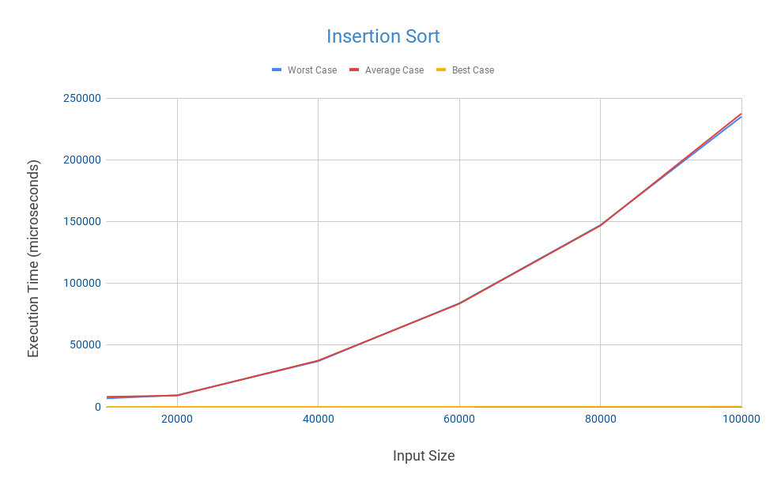

# sorting-algorithms-in-java
Selection, Insertion, Merge,  Radix sorting algorithms and Binary search algorithm compared for the worst, average and best cases in Java.

## Selection Sort and Its Execution Time 
The time Big-O complexity of the Selection Sort is O(N^2) and it’s the same for the worst, average, and best cases. Because no matter what the order is the Selection Sort compares the current element with all the others for each iteration.   

But this is the case when calculating the Big-O complexity, in real life the execution times changes slightly for the best, average and worst cases.

As you can see in the Figure 1, even though it’s slight difference, the execution times are not the same for the worst, average, and best cases. Because Selection Sort doesn’t swap all the element for the average and best cases while it does swap all the elements for the worst case which is when the array is in the reverse order.

  <b>Figure 1</b> 
 

## Insertion Sort and Its Execution Time 
The time Big-O complexity of the Insertion Sort differs based on the data set. It’s O(N) for the best case and different from the Selection Sort and it applies when the array is already sorted. When this is the case the Insertion Sort only implements one comparison for each element in the array and there is no swap between elements.  

For the average and worst case, the time Big-O complexity is the same which is O(N^2). But of course that does not mean that it’s the same as the Selection Sort because when calculating the time Big-O complexity some elements of equation is omitted and that’s why the Insertion Sort is better than the Selection Sort on the same dataset for each cases. 

As you can see in the Figure 2, on the worst and average cases the Insertion Sort takes almost the same execution time but on the best(​the yellow line, so close to the x-axis ​ ) case it takes much shorter time compared to other cases. 

  <b>Figure 2</b> 
 

 
## Merge Sort and Its Execution Time 
Merge sort is a divide and conquer algorithm that was invented by John von Neumann in 1945. Even though Merge sort is a stable algorithm and has a good performance there is one downside: it is not ‘in-place’ and that means you need to use extra memory.   

The time Big-O complexity of the Merge sort is O(NlogN) and it’s the same for the worst, average, and best cases. Because no matter what the order is the Merge Sort divides the array into two parts recursively until there is one element left in each array then compares the elements and merges them while sorting and this same implementation is done if the array is sorted, partially sorted, or in the reverse order and that’s why the time Big-O complexity is the same for all cases.  

But this is the case when calculating the Big-O complexity, in real life the execution times changes for different cases again. Because the number of swap operations changes for all the cases. For the worse case, we created another class called ​‘WorstCaseMerge’ ​ which has methods to organize the order of array by using reverse engineering so that Merge sort does the maximum number of swap operations while sorting the array. And for the average case we used a shuffled array and for the best case we used a sorted array.

As you can see in the Figure 3, on the worst case Merge Sort takes slightly longer time than on the average case but on the best(​the yellow line ​ ) case it takes much shorter time compared to other cases.

  <b>Figure 3</b> 
 

 
## Radix Sort and Its Execution Time 
Radix sort is a non-comparative sorting algorithm that sorts data with integer keys by grouping keys by the individual digits which share the same significant position and value.  

Radix sort can sort n integers in base k with at most d digits in O(d(n + k)) time. It does this by using counting sort to sort the n integers by digits, starting from the least significant digit (i.e. ones digit for integers) to the most significant digit. Each counting sort will take O(n + k) time since there are n elements and the elements are all integers in the range 0 to k since we’re in base k. Since the maximum number of digits in these n integers is d, we will have to execute counting sort d times to finish the algorithm. This is how we get a O(d(n + k)) running time for radix sort.  

Since the time complexity depends on the digit we saw that Radix sort takes much more time when sorting the bigger numbers which contains more digits. We changed our number generator method to create bigger random numbers for each data sets to show that the execution of Radix sort changes for the best, average, and worst cases. 

  <b>Figure 4</b> 
 

## Binary Search and Its Execution Time 
Binary search is a search algorithm that finds the position of a target value within a sorted array. Binary search compares the target value to the middle element of the array, if they are not equal, the half in which the target cannot lie is eliminated and the search continues on the remaining half, again taking the middle element to compare to the target value, and repeating this until the target value is found.  

The time Big-O complexity of Binary Search is O(logN) on the worst case, which occurs when the target value is not in the array and again O(logN) on the average case but it is O(1) on the best case which occurs when the target value is in the middle of the array.

  <b>Figure 5</b> 
 

